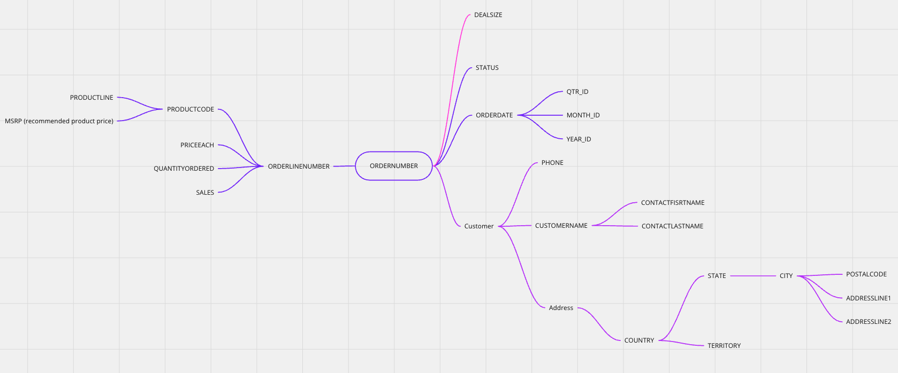

# Demand Forecast Analysis

## A Case Study in Demand Forecasting for Supply Chain Optimization

### Introduction

In this case study, we dive into the world of demand forecasting to address critical issues in the supply chain of an e-commerce company. Our primary objectives are to unveil the intricacies of the problem, detail the systematic approach taken to identify the root causes, and present the development of a demand forecasting model intended to rectify these issues.

### Discovery

#### Problem

The e-commerce company at the center of our study was besieged by an influx of customer complaints related to undelivered or persistently unavailable products. These issues created substantial disruptions to the company's operations and reputation.

#### Interviews

To understand the problem comprehensively, we conducted interviews with various stakeholders, including:

- **Customers:** Many customers reported not receiving products they had ordered, leading to dissatisfaction.
- **Business Department:** The business department believed the problem was systemic, but they struggled to quantify the extent of undelivered products.
- **Technology Department:** Investigations by the technology department revealed integration issues had been resolved, yet orders were not being effectively communicated to the logistics team.
- **Logistics Department:** The logistics team, on the other hand, claimed they had the necessary resources for deliveries but faced difficulties due to product unavailability.

#### Root Causes

Our investigation unearthed two primary root causes for the issues:

- **Listing Out-of-Stock Products:** Products that were listed as available on the e-commerce platform were, in reality, out of stock.
- **Lack of Predictability:** The company lacked an effective system to predict which products required more stock, which contributed to the persistence of the problem.

#### Solutions

To address these issues, the following solutions were proposed:

- **Systemic Issue Resolution:** Rectify the systemic problem of listing products as available when they are out of stock. This includes providing improved visibility to the business and logistics teams.
- **Demand-Based Stock Optimization:** Optimize stock levels based on demand patterns to mitigate the root cause of the problem.

#### Benefits

Implementing these solutions is expected to yield numerous advantages, including:

- **Revenue Increase:** By reducing the number of canceled purchases due to unavailability, the company can expect increased revenue.
- **Operational Optimization:** Improved metrics for the logistics and business teams, leading to more efficient operations.

### Data Understanding

For this project, we utilized data from the Kaggle dataset "Sample Sales Data" (available [here](https://www.kaggle.com/datasets/kyanyoga/sample-sales-data)). Before delving into the analysis, it is crucial to gain a comprehensive understanding of the dataset and establish connections between the data variables and the business context.

#### Mind Map

To facilitate this understanding, we constructed a mind map that provides an overview of the dataset and its relevance to the business problem. This visualization aids in forming a clear picture of how the data can be used to address the challenges at hand.

### Generating Hypotheses

After acquiring a solid grasp of the data, the next step is to formulate hypotheses. These hypotheses serve a dual purpose: they connect the data analysis to the business problem and offer valuable insights to guide decision-making.

Hypotheses are at the core of our analytical approach, not only for building predictive models but also for addressing various business queries and uncertainties. Formulating and testing hypotheses ensures that our analysis adds value beyond predictive modeling and safeguards against inaccurate predictions.

### Feature Engineering

Using the formulated hypotheses, we will create features that aid in answering them. Additionally, we will explore time series features to enhance our predictions and provide a more comprehensive view of the data.

### Making Predictions

With hypotheses in place and a solid understanding of the data, we can proceed to create features for our model and aim to improve our predictive metrics.

For this project, we used the predicted target as the sales for the next month for each product. This means we have data from all months up to the lag_1 month sale.

#### Metrics

Selecting an appropriate metric to evaluate our model's performance is crucial. The business team has already chosen the WMAPE (Weighted Mean Absolute Percentage Error) as their metric, which we will also use for comparison.

WMAPE measures the accuracy of our demand forecast by quantifying the closeness of our predicted values to the target values. It is a valuable metric, with higher values indicating worse predictions.

The formula for WMAPE is as follows:

$$WMAPE = \frac{\sum_{t=1}^{n}{|A_t - F_t|}}{\sum_{t=1}^{n}{|A_t|}},$$

where $A_t$ represents the target and $F_t$ represents the predicted value.

Stay tuned as we delve deeper into our demand forecasting journey, exploring how data science and predictive modeling can drive improvements in the e-commerce supply chain.

### Future
- Add feature engineering to src
- Implement MLFlow
- Hyperparameter tunning
- Implemente Cross Validation
- Group the sales to create new features:
    - total sales
    - product line sales
    - product sales
    - country sales
    - territory sales
    - deal size sales
- Create Markov Chain model
- Create stacking ensemble model using:
    - ARIMA
    - Prophet
    - Random Forest